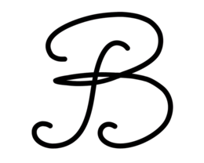

# bomr



Is your text editor polluting your precious code with UTF-8 BOMs? bomr is here to help.

## Usage

```bash
bomr <files>
```

### I want to do this for all files in &lt;dir&gt;.

```bash
bomr -r <dir>
```

#### Except for files whose full name matches &lt;regex&gt;.

```bash
bomr -r <dir> -e "<regex>" # note the quotes
```

## Supported Platforms

Any system that supports Bash should be good to go, including:

- Linux
- OS X
- Git Bash (aka MinGW)
- Cygwin

## Installing bomr

bomr uses [sinister](https://github.com/jamesqo/sinister) for installation. To install, run

```bash
sh <(curl -sSL http://git.io/sinister) -u http://github.com/jamesqo/bomr/raw/master/bomr
```

## Contributing

Contributors are welcome! Please feel free to report bugs or make pull requests to this repo.

## License

bomr is licensed under the [BSD simplified license](license.bsd).
